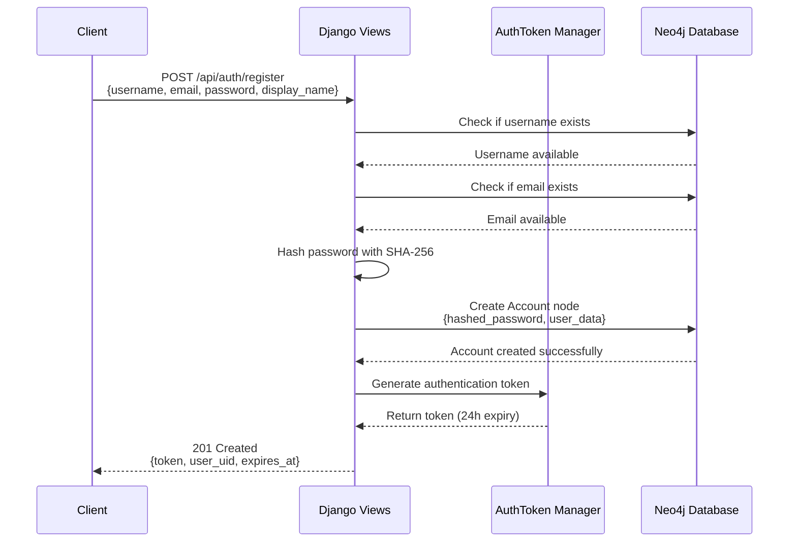
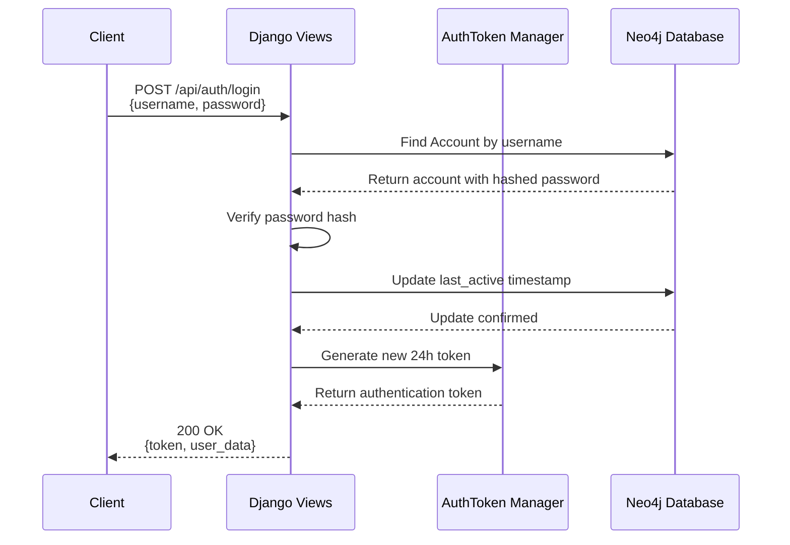
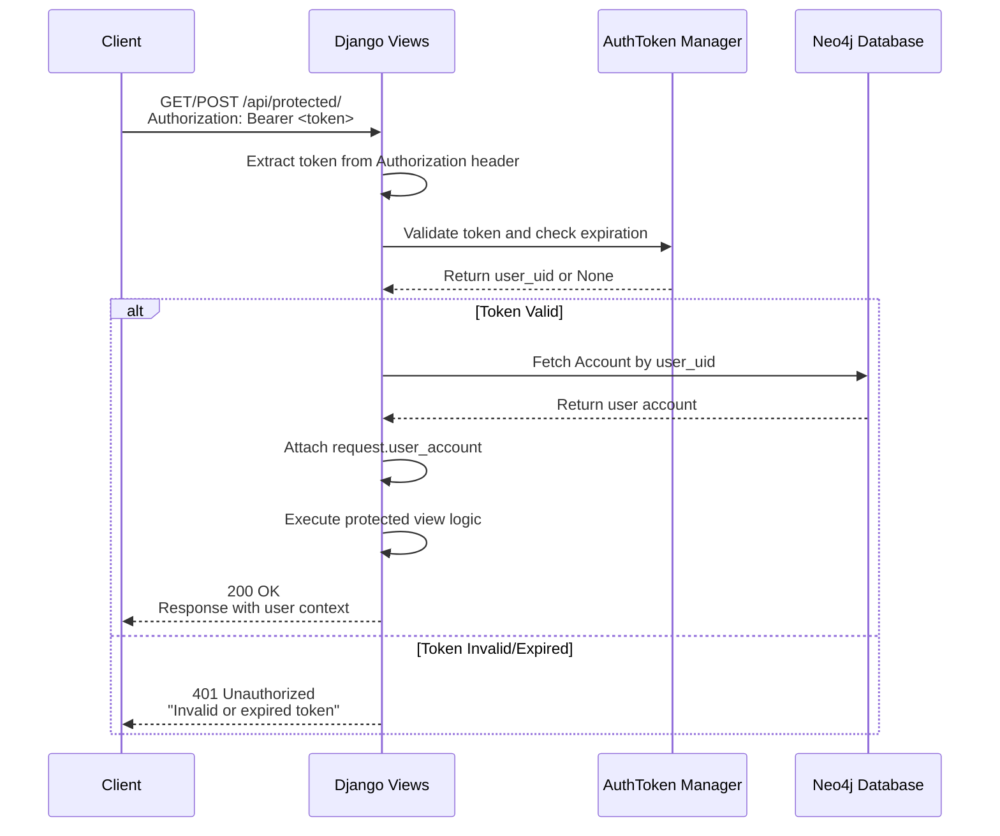
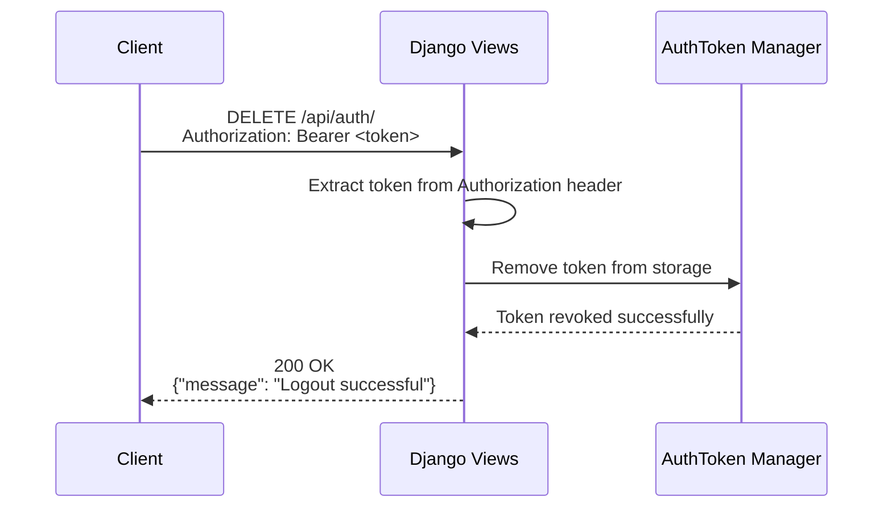

# 🔐 Authentication System Documentation


## 🏗️ Architecture Components

### 1. **AuthToken Manager** (`authentication.py`)
- **Purpose**: Manages authentication tokens in memory
- **Storage**: In-memory dictionary (development) - should use Redis/database in production
- **Token Format**: URL-safe base64 encoded 32-byte random token
- **Expiration**: 24 hours from creation
- **Methods**:
  - `create_token(user_uid)` - Generate new token
  - `validate_token(token)` - Verify token and return user_uid
  - `revoke_token(token)` - Invalidate token (logout)

### 2. **Authentication Decorator** (`@authenticate_request`)
- **Purpose**: Protects endpoints requiring authentication
- **Behavior**: Validates Bearer token and attaches user to request
- **Usage**: Applied to view methods that need authentication

### 3. **Password Security**
- **Hashing**: SHA-256 with salt
- **Storage**: Hashed passwords stored in Neo4j Account nodes
- **Validation**: Plain text password hashed and compared

### 4. **User Management**
- **Database**: Neo4j graph database via neomodel ORM
- **Model**: Account nodes with relationships
- **Validation**: Username and email uniqueness checks

---

## 🔄 Authentication Flows

### **User Registration Flow**



**Request:**
```json
POST /api/auth/
{
  "action": "register",
  "username": "john_doe",
  "email": "john@example.com",
  "password": "securepassword123",
  "display_name": "John Doe",
  "bio": "Sharing my emotional journey"
}
```

**Response:**
```json
{
  "message": "Registration successful",
  "token": "abc123xyz789...",
  "user": {
    "uid": "unique-user-id",
    "username": "john_doe",
    "display_name": "John Doe",
    "email": "john@example.com"
  }
}
```

### **User Login Flow**



**Request:**
```json
POST /api/auth/
{
  "action": "login",
  "username": "john_doe",
  "password": "securepassword123"
}
```

**Response:**
```json
{
  "message": "Login successful",
  "token": "xyz789abc123...",
  "user": {
    "uid": "unique-user-id",
    "username": "john_doe",
    "display_name": "John Doe",
    "email": "john@example.com",
    "feelings_shared_count": 5
  }
}
```

### **Protected Resource Access Flow**



### **Logout Flow**



---

## 🛡️ Security Features

### **Token Management**
- **Generation**: `secrets.token_urlsafe(32)` - cryptographically secure
- **Storage**: In-memory dictionary with expiration tracking
- **Transmission**: Bearer token in Authorization header
- **Expiration**: Automatic cleanup of expired tokens
- **Scope**: Single-use tokens (new token on each login)

### **Password Security**
- **Hashing**: SHA-256 with UTF-8 encoding
- **Storage**: Only hashed passwords stored, never plaintext
- **Validation**: Constant-time comparison via hash matching
- **Requirements**: No specific requirements enforced (customizable)

### **Request Validation**
- **Header Format**: `Authorization: Bearer <token>`
- **Token Validation**: Existence, expiration, and user verification
- **Error Handling**: Consistent 401 responses for auth failures
- **User Context**: Authenticated user attached to request object

---

## 🔗 Protected Endpoints

### **Endpoints Requiring Authentication**

| Endpoint | Method | Purpose |
|----------|--------|---------|
| `/api/profile/` | GET | Get current user profile |
| `/api/profile/` | PUT | Update user profile |
| `/api/posts/` | POST | Create new post |
| `/api/friend-requests/` | GET | Get friend requests |
| `/api/friend-requests/` | POST | Send friend request |
| `/api/friend-requests/<id>/` | PUT | Accept/reject friend request |

### **Public Endpoints (No Authentication)**

| Endpoint | Method | Purpose |
|----------|--------|---------|
| `/api/auth/` | POST | Register/Login |
| `/api/accounts/` | GET | List all accounts |
| `/api/posts/` | GET | View public posts |
| `/api/feelings/` | GET | List available emotions |
| `/api/health/` | GET | System health check |
| `/api/demo/` | GET | Demo interface |

---

## 💻 Implementation Examples

### **Protecting a View with Authentication**

```python
from .authentication import authenticate_request

class MyProtectedView(View):
    @method_decorator(csrf_exempt)
    def dispatch(self, request, *args, **kwargs):
        return super().dispatch(request, *args, **kwargs)
    
    @authenticate_request
    def post(self, request):
        # Access authenticated user
        user = request.user_account
        
        # Your protected logic here
        return JsonResponse({
            'message': f'Hello {user.username}!',
            'user_uid': user.uid
        })
```

### **Client-Side Token Usage**

```javascript
// Store token after login
const authToken = response.data.token;
localStorage.setItem('auth_token', authToken);

// Use token in subsequent requests
const headers = {
    'Authorization': `Bearer ${authToken}`,
    'Content-Type': 'application/json'
};

fetch('/api/posts/', {
    method: 'POST',
    headers: headers,
    body: JSON.stringify({
        body: 'My new post!',
        feeling_name: 'Joyful'
    })
});
```

### **Token Validation in Detail**

```python
def authenticate_request(view_func):
    @wraps(view_func)
    def wrapper(self, request, *args, **kwargs):
        # 1. Extract token from Authorization header
        auth_header = request.META.get('HTTP_AUTHORIZATION', '')
        if not auth_header.startswith('Bearer '):
            return JsonResponse({'error': 'Authentication required'}, status=401)
        
        # 2. Validate token format and existence
        token = auth_header.split(' ')[1]
        user_uid = AuthToken.validate_token(token)
        
        # 3. Check token validity and expiration
        if not user_uid:
            return JsonResponse({'error': 'Invalid or expired token'}, status=401)
        
        # 4. Fetch user from database
        try:
            request.user_account = Account.nodes.get(uid=user_uid)
        except Account.DoesNotExist:
            return JsonResponse({'error': 'User not found'}, status=401)
        
        # 5. Execute protected view with user context
        return view_func(self, request, *args, **kwargs)
    
    return wrapper
```

---

## 🔧 Configuration & Customization

### **Token Expiration**
```python
# In AuthToken.create_token()
expires = datetime.now() + timedelta(hours=24)  # Modify as needed
```

### **Password Hashing Algorithm**
```python
def hash_password(password):
    # Current: SHA-256
    return hashlib.sha256(password.encode()).hexdigest()
    
    # Alternative: bcrypt (recommended for production)
    # import bcrypt
    # return bcrypt.hashpw(password.encode(), bcrypt.gensalt()).decode()
```

### **Production Token Storage**
```python
# Replace in-memory storage with Redis
import redis

class AuthToken:
    redis_client = redis.Redis(host='localhost', port=6379, db=0)
    
    @classmethod
    def create_token(cls, user_uid):
        token = secrets.token_urlsafe(32)
        cls.redis_client.setex(
            f"auth_token:{token}", 
            86400,  # 24 hours in seconds
            user_uid
        )
        return token
```

---

## 🚨 Error Handling

### **Authentication Error Responses**

| Status | Error | Description |
|--------|-------|-------------|
| 400 | `"Invalid action"` | Wrong action parameter in auth request |
| 400 | `"Username and password required"` | Missing credentials |
| 400 | `"Username already exists"` | Registration with existing username |
| 400 | `"Email already exists"` | Registration with existing email |
| 401 | `"Authentication required"` | Missing Authorization header |
| 401 | `"Invalid or expired token"` | Token validation failed |
| 401 | `"Invalid credentials"` | Wrong username/password |
| 401 | `"User not found"` | Valid token but user deleted |

### **Common Authentication Issues**

1. **Missing Authorization Header**
   ```
   Error: "Authentication required"
   Solution: Include "Authorization: Bearer <token>" header
   ```

2. **Expired Token**
   ```
   Error: "Invalid or expired token"
   Solution: Re-authenticate to get new token
   ```

3. **Malformed Token**
   ```
   Error: "Authentication required"
   Solution: Ensure format is "Bearer <token>"
   ```

---

## 📊 Authentication Statistics

The system tracks user authentication statistics:

- **Registration**: New account creation timestamp
- **Login Activity**: `last_active` field updated on each login
- **Usage Metrics**: `feelings_shared_count` and `posts_read_count`
- **Token Lifecycle**: Creation, validation, and expiration tracking

---

## 🔒 Security Best Practices

### **Current Implementation**
✅ Secure token generation (`secrets` module)  
✅ Token expiration (24 hours)  
✅ Password hashing (SHA-256)  
✅ Authorization header validation  
✅ User existence verification  
✅ CSRF protection for forms  

### **Production Recommendations**
🔄 **Upgrade to bcrypt** for password hashing  
🔄 **Implement Redis** for token storage  
🔄 **Add rate limiting** for auth endpoints  
🔄 **Enable HTTPS** for token transmission  
🔄 **Add password requirements** (length, complexity)  
🔄 **Implement refresh tokens** for mobile apps  
🔄 **Add audit logging** for security events  

---

## 🧪 Testing Authentication

### **Manual Testing with cURL**

```bash
# Register new user
curl -X POST http://localhost:8002/api/auth/ \
  -H "Content-Type: application/json" \
  -d '{
    "action": "register",
    "username": "testuser",
    "email": "test@example.com",
    "password": "testpass123",
    "display_name": "Test User"
  }'

# Login
curl -X POST http://localhost:8002/api/auth/ \
  -H "Content-Type: application/json" \
  -d '{
    "action": "login",
    "username": "testuser",
    "password": "testpass123"
  }'

# Access protected endpoint
curl -X GET http://localhost:8002/api/profile/ \
  -H "Authorization: Bearer YOUR_TOKEN_HERE"

# Logout
curl -X DELETE http://localhost:8002/api/auth/ \
  -H "Authorization: Bearer YOUR_TOKEN_HERE"
```

### **Automated Testing**
```bash
# Run authentication tests
cd feels_backend
python test/test_auth.py

# Run comprehensive tests
python test/comprehensive_test.py
```

---

## 📱 Mobile App Integration

### **Flutter Example**
```dart
class AuthService {
  static const String baseUrl = 'http://your-api.com/api';
  
  Future<AuthResponse> login(String username, String password) async {
    final response = await http.post(
      Uri.parse('$baseUrl/auth/'),
      headers: {'Content-Type': 'application/json'},
      body: jsonEncode({
        'action': 'login',
        'username': username,
        'password': password,
      }),
    );
    
    if (response.statusCode == 200) {
      final data = jsonDecode(response.body);
      // Store token securely
      await SecureStorage.store('auth_token', data['token']);
      return AuthResponse.fromJson(data);
    }
    throw AuthException('Login failed');
  }
  
  Future<http.Response> authenticatedRequest(String endpoint) async {
    final token = await SecureStorage.get('auth_token');
    return http.get(
      Uri.parse('$baseUrl$endpoint'),
      headers: {'Authorization': 'Bearer $token'},
    );
  }
}
```

### **React Native Example**
```javascript
import AsyncStorage from '@react-native-async-storage/async-storage';

class AuthService {
  static baseUrl = 'http://your-api.com/api';
  
  static async login(username, password) {
    const response = await fetch(`${this.baseUrl}/auth/`, {
      method: 'POST',
      headers: { 'Content-Type': 'application/json' },
      body: JSON.stringify({
        action: 'login',
        username,
        password,
      }),
    });
    
    const data = await response.json();
    if (response.ok) {
      await AsyncStorage.setItem('auth_token', data.token);
      return data;
    }
    throw new Error(data.error);
  }
  
  static async authenticatedFetch(endpoint, options = {}) {
    const token = await AsyncStorage.getItem('auth_token');
    return fetch(`${this.baseUrl}${endpoint}`, {
      ...options,
      headers: {
        ...options.headers,
        'Authorization': `Bearer ${token}`,
      },
    });
  }
}
```

---

## 🔍 Troubleshooting

### **Common Issues & Solutions**

1. **"Authentication required" despite sending token**
   - Check Authorization header format: `Bearer <token>`
   - Verify token is not empty or malformed
   - Ensure no extra spaces in header value

2. **"Invalid or expired token" on valid login**
   - Check server system time (affects expiration)
   - Verify token storage isn't being cleared
   - Confirm token was properly saved after login

3. **Registration fails with "Username already exists"**
   - Usernames are case-sensitive and must be unique
   - Check for existing test data in database
   - Use different username for testing

4. **Neo4j connection errors during authentication**
   - Verify Neo4j container is running: `docker ps`
   - Check connection string in settings
   - Restart Neo4j: `./start_neo4j.sh`

### **Debug Authentication Flow**
```python
# Add to authentication.py for debugging
import logging
logger = logging.getLogger(__name__)

def authenticate_request(view_func):
    @wraps(view_func)
    def wrapper(self, request, *args, **kwargs):
        auth_header = request.META.get('HTTP_AUTHORIZATION', '')
        logger.debug(f"Auth header: {auth_header}")
        
        if not auth_header.startswith('Bearer '):
            logger.warning("Missing or invalid Authorization header")
            return JsonResponse({'error': 'Authentication required'}, status=401)
        
        token = auth_header.split(' ')[1]
        logger.debug(f"Extracted token: {token[:10]}...")
        
        user_uid = AuthToken.validate_token(token)
        logger.debug(f"Token validation result: {user_uid}")
        
        # ... rest of function
```

---

This authentication system provides a solid foundation for secure user management in the Feels Backend. The token-based approach is stateless, scalable, and suitable for both web and mobile applications.
